# 🚗 Merlin AutoNoleggio

## 👨‍💻 Autore

**Matteo Merlin – 5°N Informatica e Telecomunicazioni – A.S. 2024/25**

> Progetto scolastico completo per la gestione di un autonoleggio online.

## 🧾 Descrizione

Applicazione web sviluppata in PHP, HTML/CSS e MySQL con:
- Area pubblica per visualizzazione auto
- Registrazione/login utenti
- Prenotazione auto online
- Pannello di controllo per amministratori con le funzioni associate

## 📁 Struttura

- `index.php` – Homepage con lista auto
- `login.php` – Accesso utenti/admin
- `admin.php` – Pannello gestione
- `prenota.php` – Prenotazione auto
- `miePrenotazioni.php` – Storico cliente

## 🔐 Sicurezza

- Password criptate con `password_hash()`
- Login protetto con `password_verify()`
- SQL sicuro con `prepare()` e `bind_param()`

## 📸 Screenshot

Patina di index:
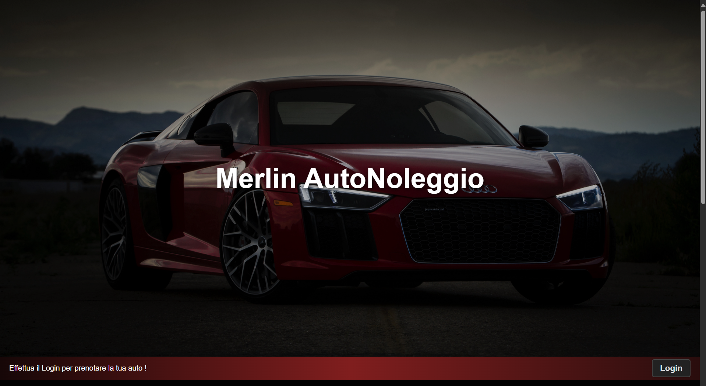

Pagina di showroom con accesso libero:
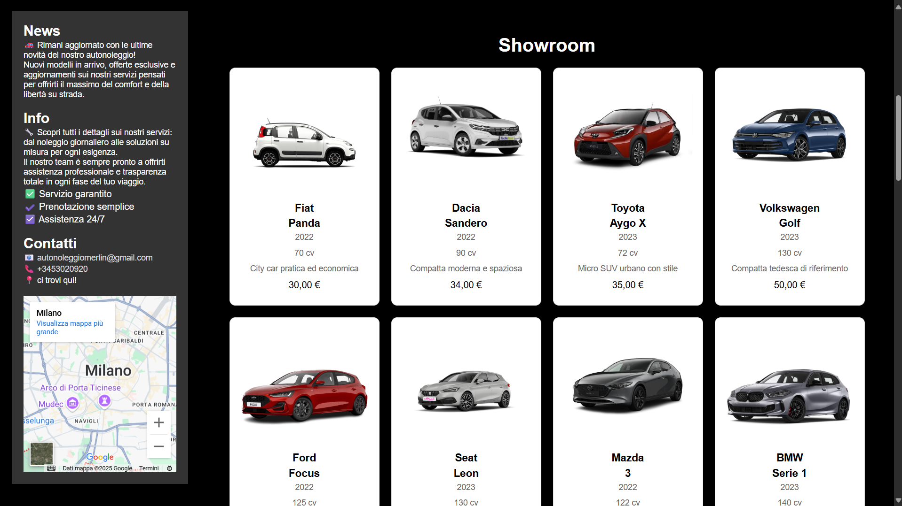

Pagina di Login:
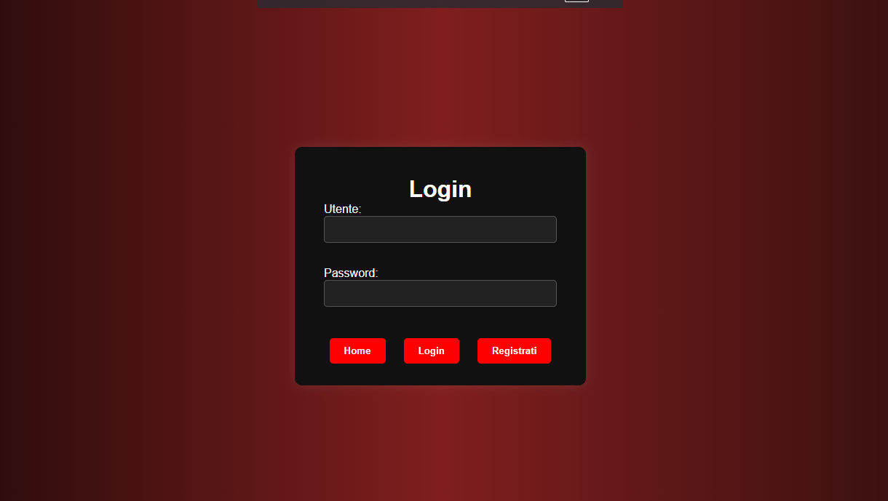

Pagina di registrazione nuovo cliente:
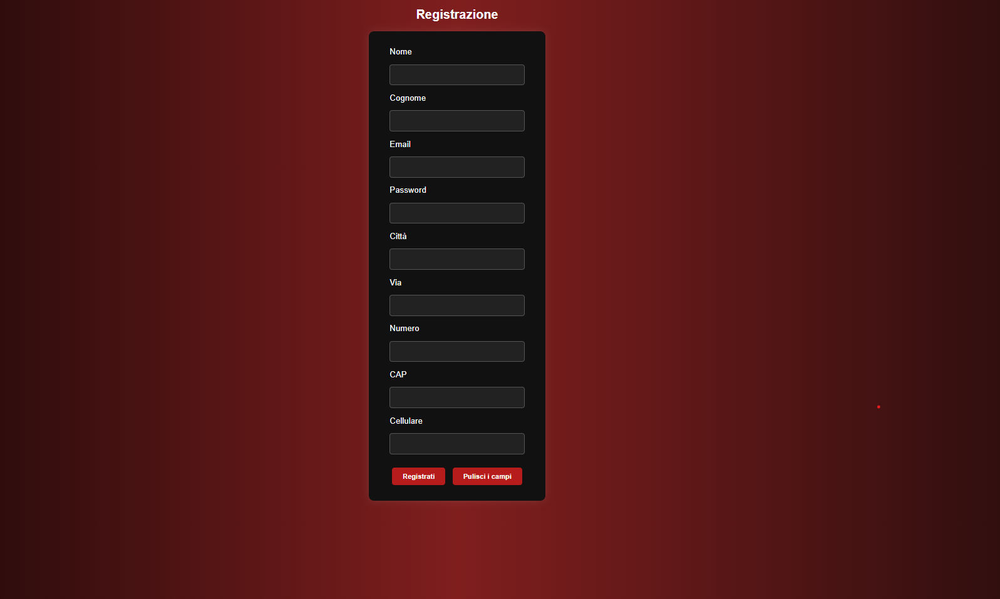

Pagina iniziale per itenti Admin:
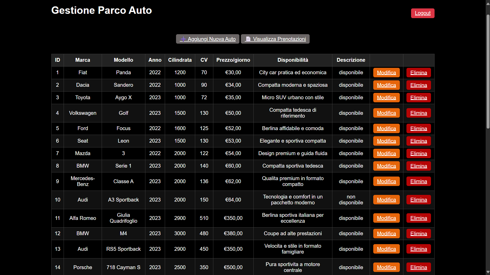

Reparto Admin-:
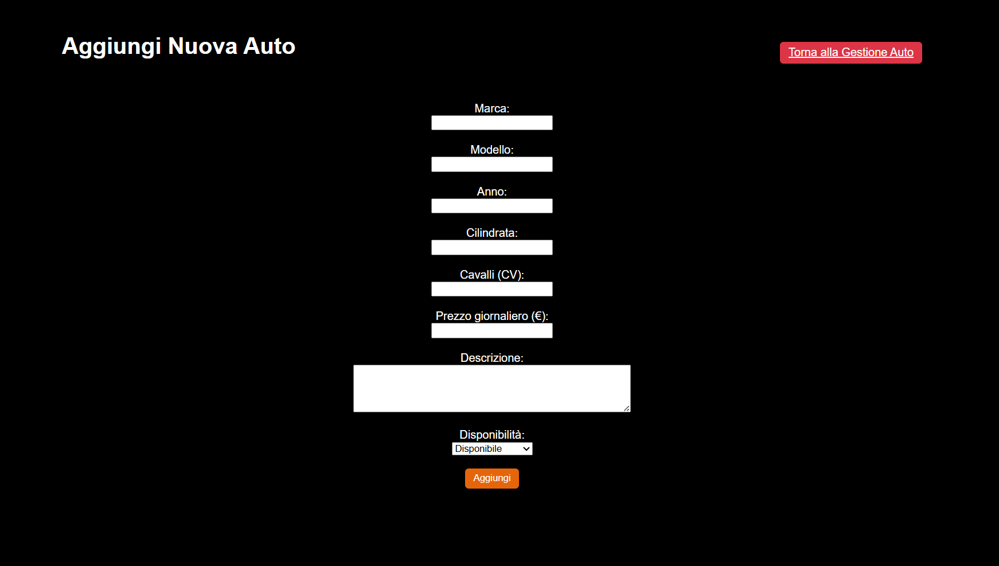

Reparto Admin-:
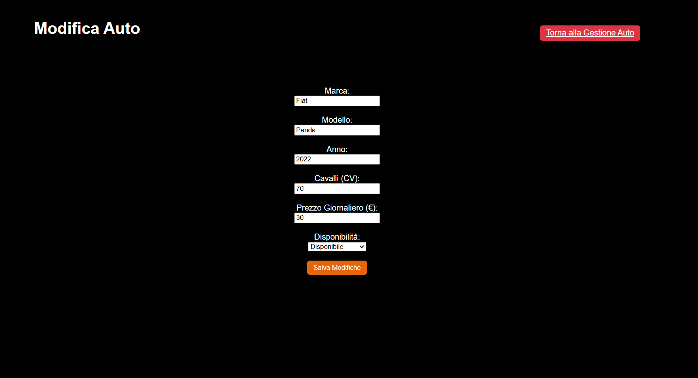

Reparto Admin-:
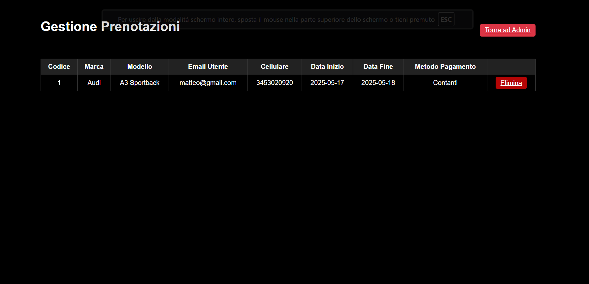

Pagina di showroom con accesso come client:
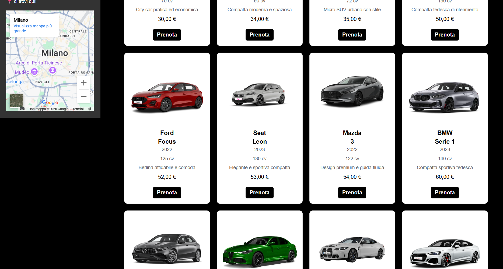

 Reparto Client-:
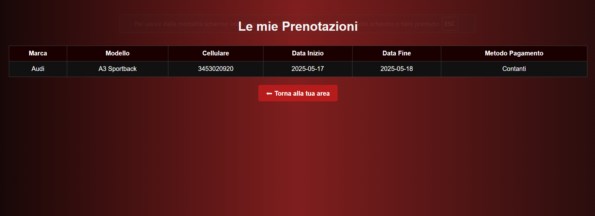

Reparto Client-:
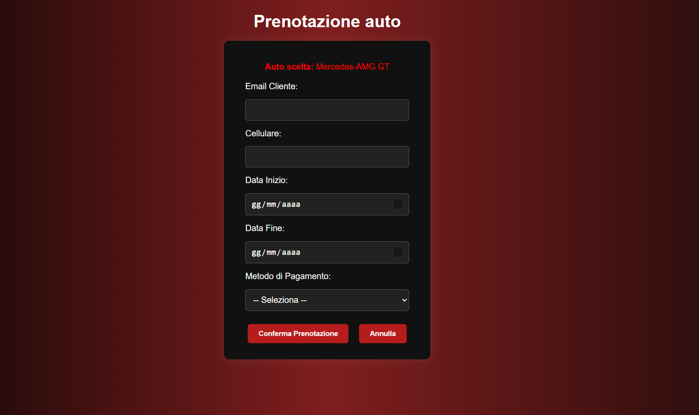

